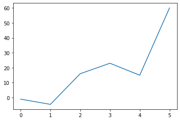
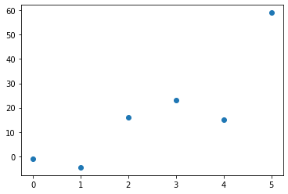
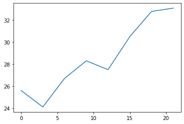
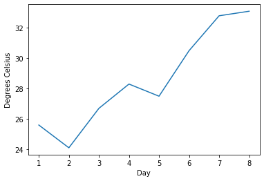
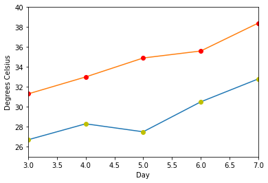
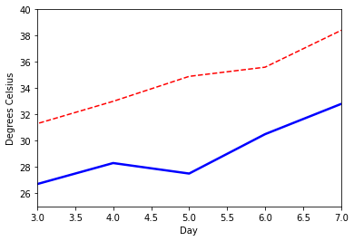
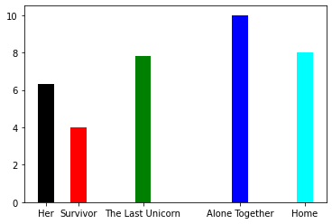
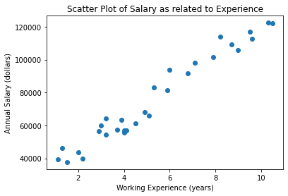

# Session 03 | Lab

### Learning Objectives

### Summary

### Useful links

## Part A: Matplotlib
One reason for the attractiveness of Matplotlib lies in the fact that it is seen as a good alternative to MATLAB when it comes to 
plotting when used in conjunction with NumPy and SciPy. While MATLAB is expensive, closed-source software, 
Matplotlib's software is free, free, and open-source. With Matplotlib you can create diagrams and representations in 
different formats. Another special feature is the steep learning curve, which can be seen in the fact that the users make
The officila Matplotlib website puts it like this: "Matplotlib tries to make easy things easy and hard things possible.
You can generate plots, histograms, power spectra, bar charts, errorcharts, scatterplots, etc., with just a few lines of code."
### 1. Introduction
Let's begin with some easy graphs.
With the help of the following command we can change the format of the diagrams from png to svg:
```python
%config InlineBackend.figure_formats = ['svg']
```
A graph in Matplotlib is a two- or three-dimensional drawing that uses points, curves, bars or other means to establish
relationships. There are two axes: the horizontal x-axis for the independent values and the vertical y-axis for the 
dependent values. We will use the pyplot sub-module in the following. pyplot provides a procedural interface to the
object-oriented plot library of Matplotlib. It is common practice to rename matplotlib.pyplot to plt. In our first example,
we will use the plot function of pyplot. We pass a list of values to the plot function. plot considers and uses the values
from this list as y values. The indices of this list are automatically taken as x-values.

```python
import matplotlib.pyplot as plt

plt.plot([-1, -4.5, 16, 23, 15, 59])
plt.show()
```


We see a connected graph, although we only provided discrete values for the Y-axis. The indices were taken as values for
the X-axis. By passing a format string with the function call, we can generate a graph with discrete values. You can learn about other format strings [here](https://matplotlib.org/stable/api/_as_gen/matplotlib.pyplot.plot.html).
The format string defines how the discrete points are to be represented, in our case with blue full circles.

```python
plt.plot([-1, -4.5, 16, 23, 15, 59], "o")
plt.show()
```


As some have probably already suspected, you can also use the plot function for X-values. In the following example we
pass a list with the multiples of 3 between 0 and 21 as X-values to plot:

```python
# X-values:
days = list(range(0, 22, 3))
print(days)

# Y-values:
celsius_values = [25.6, 24.1, 26.7, 28.3, 27.5, 30.5, 32.8, 33.1]
plt.plot(days, celsius_values)
plt.show()
```


We can improve the look of our graph by adding labels to the axes. For this we use the ylabel and xlabel functions of pyplot.

```python
days = list(range(1,9))
celsius_values = [25.6, 24.1, 26.7, 28.3, 27.5, 30.5, 32.8, 33.1]
plt.plot(days, celsius_values)
plt.xlabel('Day')
plt.ylabel('Degrees Celsius')
plt.show()
```


We can specify any number of (x, y, fmt) groups in a plot function. In the following example we use two different lists
with Y values. Sometimes you might also want to further specify the range of your axes.
Startx and endx allow you to specify the range of your X-axis. The same, of course, applies to the Y-axis.

```python
days = list(range(1,9))
celsius_min = [19.6, 24.1, 26.7, 28.3, 27.5, 30.5, 32.8, 33.1]
celsius_max = [24.8, 28.9, 31.3, 33.0, 34.9, 35.6, 38.4, 39.2]

plt.xlabel('Day')
plt.ylabel('Degrees Celsius')

startx, endx = 3, 7
starty, endy = 25, 40
plt.axis([startx, endx, starty, endy])

plt.plot(days, celsius_min,  # plots connected points from celsius_min
days, celsius_min, "oy",     # plots discrete points ("o") from celcius_min in yellow ("y")
days, celsius_max,           # plots connected points from celcius_max
days, celsius_max, "or")     # plots discrete points ("o") from celcius_max in red ("r")
plt.show()
```


The line style of a plot can be set by the parameters linestyle or ls of the plot function. They can be set to one of the
following values: '-', '–-', '-.', ':', 'None', ''.We can use linewidth, as the name implies, to specify the line width:
```python
days = list(range(1,9))
celsius_min = [19.6, 24.1, 26.7, 28.3, 27.5, 30.5, 32.8, 33.1]
celsius_max = [24.8, 28.9, 31.3, 33.0, 34.9, 35.6, 38.4, 39.2]

plt.xlabel('Day')
plt.ylabel('Degrees Celsius')

startx, endx = 3, 7
starty, endy = 25, 40
plt.axis([startx, endx, starty, endy])

plt.plot(days, celsius_min, color="blue", linewidth=2.5, linestyle="-")
plt.plot(days, celsius_max, color="red", linewidth=1.5, linestyle="--")
plt.show()
```


If we look at the line graphs in the previous examples, we notice that we always have to look at the code to understand
what kind of function is being represented. For the sake of simplicity, this information should appear directly in the
diagram. Legends are used for this. A legend contains one or more entries. Each entry consists of a key and a label.
The pyplot function legend () places a legend in the plot. Matplotlib determines the best position to place the legend.
If you want to have control yourself, you can pass the optional argument loc. The value can be one of the following
strings: 'upper left', 'upper right', 'lower left', 'lower right', 'upper center', 'lower center', 'center left', 'center
 right', 'center' or 'best'.

```python
plt.plot([1, 2, 3, 4], label='an ascending line') # ascending line
plt.plot([4, 3, 2, 1], label='a descending line') # descending line
plt.plot([2, 4, 3, 1], 'o', label='some points') # some points

plt.legend(loc='upper center')
plt.show()
```


## Part B: Bar Charts and Ticks
Up to now - in all previous examples - Matplotlib has automatically determined the labeling of the scales. 
These markings on the axes are called "ticks" and the associated numbers are called "tick labels". 
The function x-ticks allows the position and labeling of the "ticks" to be specified.
```python
film_dict = {'Her': 6.3,
 'Survivor': 4.0,
 'The Last Unicorn': 7.8,
 'Alone Together': 10,
 'Home': 8}

film_titles = list(film_dict.keys())
film_scores = list(film_dict.values())

width = [0.5,0.5,0.5,0.5,0.5]
x_pos = [0,1,3,6,8]
 
# Make the plot
plt.bar(x_pos, film_scores, width=width, color=['black', 'red', 'green', 'blue', 'cyan'])

# Create names on the x-axis
plt.xticks(x_pos, film_titles)
 
# Show graphic
plt.show()
```


## Part C: Scatter Plots
Pandas is a very useful Python library when it comes to data manipulation and analysis. We won't go into detail here, but
at least show you the very helpful read_csv function that lets you easily import a csv file for further exploration.

```python
import matplotlib.pyplot as plt
import pandas as pd

data = pd.read_csv("data/salary_data.csv")  # load dataset

experience = data["YearsExperience"]
salary = data["Salary"]
plt.scatter(experience, salary)
plt.title("Scatter Plot of Salary as related to Experience")
plt.xlabel("Working Experience (years)")
plt.ylabel("Annual Salary (dollars)")
plt.show()
```



### Congratulations! You've completed today's lab!
